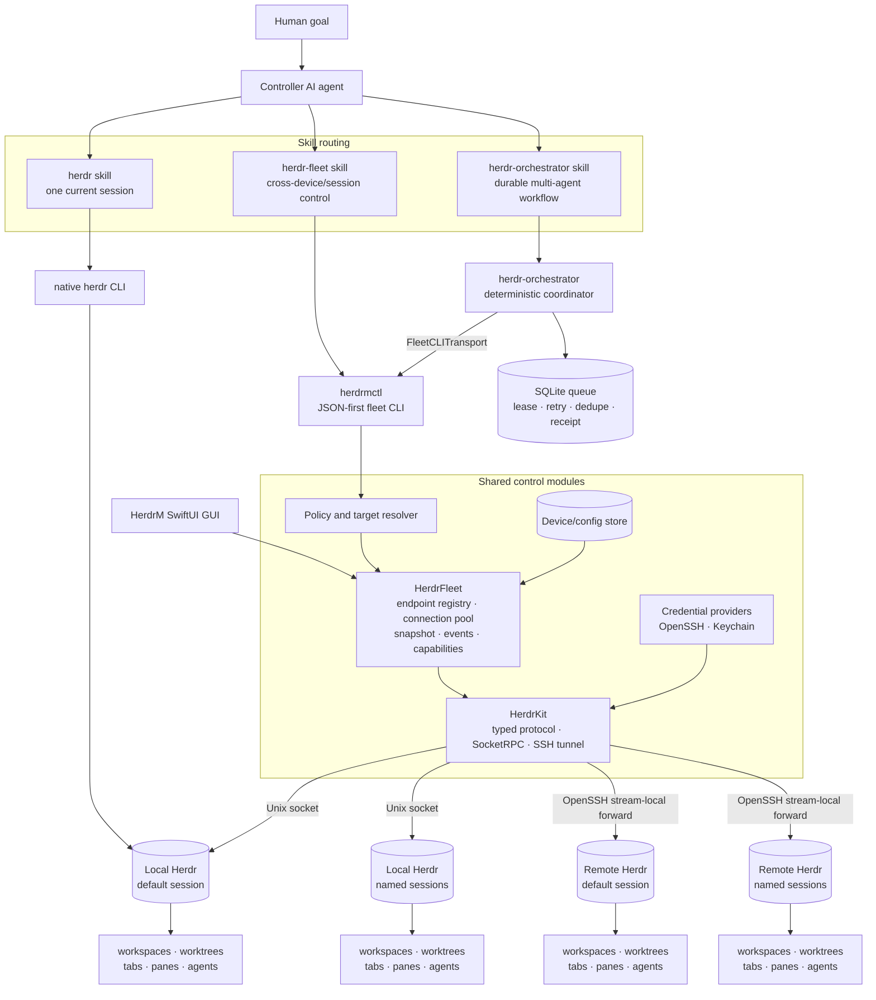
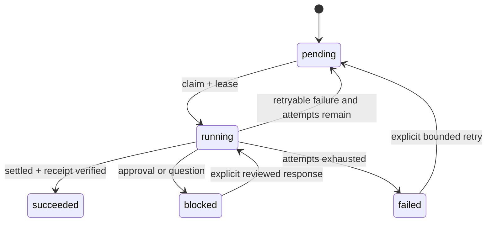

# HerdrM AI Agent Control Plane

> Status: proposed
> Date: 2026-08-26
> Scope: overall architecture and implementation roadmap, not an implementation spec

## 1. Executive decision

Add an AI-facing control surface to HerdrM without turning HerdrM itself into an
agent runtime:

1. **`herdrmctl`** is a new Swift command-line executable. It controls local and
   remote Herdr sessions through a stable, JSON-first interface.
2. **`HerdrFleet`** is the deep module shared by `herdrmctl` and the HerdrM GUI.
   It owns device/session addressing, connection lifecycle, capability
   negotiation, global resource identity, and safety policy.
3. **HerdrKit remains the protocol and transport implementation**. Extend its
   socket method coverage and SSH tunnel so it can address named sessions, then
   reuse it rather than implementing another SSH/RPC stack.
4. **The existing `herdr-orchestrator` remains the durable workflow engine**.
   Add a `herdrmctl` transport adapter and endpoint fields to its queue instead
   of porting its lease, retry, receipt, and topology logic into Swift.
5. **Skills form a three-level routing system**:
   - upstream `herdr` skill for one current session;
   - new `herdr-fleet` skill for explicit cross-device/session control;
   - extended `herdr-orchestrator` skill for durable multi-agent workflows.

This keeps Herdr as the terminal runtime, HerdrM/HerdrFleet as the fleet control
plane, and `herdr-orchestrator` as the deterministic workflow plane.

## 2. Goals

- Let one controller agent discover and control multiple Herdr sessions on the
  local Mac and SSH devices.
- Address device, session, workspace, worktree, tab, pane, and agent without
  relying on GUI focus.
- Provide machine-stable JSON, bounded waits, stable error codes, and global
  identifiers suitable for AI tool use.
- Reuse Herdr's socket methods and lifecycle semantics.
- Reuse HerdrM's device store, SSH forwarding, reconnect behavior, and domain
  models.
- Reuse `herdr-orchestrator` for durable queues, leases, retries, deduplication,
  receipts, topology placement, and harness routing.
- Keep the GUI and CLI as two callers of the same fleet module.
- Fail closed for destructive, ambiguous, unsupported, and cross-target actions.

## 3. Non-goals

- Do not replace Herdr's TUI or native `herdr` CLI.
- Do not create another terminal multiplexer or PTY owner.
- Do not let an LLM own queue transitions, leases, retries, or cleanup rules.
- Do not treat `idle` or `done` as proof that a task is correct.
- Do not make HerdrM.app a required background daemon for CLI use.
- Do not add arbitrary remote shell execution. Ordinary commands run through
  `pane.run`; SSH remains limited to transport, probes, and approved file
  staging.
- Do not automatically push, merge, publish, deploy, delete worktrees, or
  answer blocked approval dialogs.
- Do not copy the `herdr-orchestrator` source into this repository.

## 4. Verified reusable assets

The design is based on the current checkout and installed Herdr 0.8.2.

| Asset | Reuse | Gap to close |
| --- | --- | --- |
| Herdr socket protocol | Primary runtime interface. NDJSON over Unix socket, request `params` always present. | Installed protocol is 20. Some HerdrM comments still describe protocol 19. Add protocol fixtures and a capability table. |
| Native `herdr` CLI | Syntax and lifecycle authority for single-session behavior. Its `--skill`, help, and API schema are compatibility inputs. | It does not provide one aggregate namespace for HerdrM's saved SSH devices and named sessions. |
| Upstream Herdr skill | Reuse current-session safety, pane/agent semantics, wait rules, and output caveats. | It requires `HERDR_ENV=1` and intentionally cannot control a different session. |
| `SocketRPC` | Reuse request/response and event streaming. | Add request metadata, cancellation/deadline consistency, and protocol contract tests. |
| `HerdrService` | Reuse typed operations and connection ownership. | Expand from the current subset to worktree, full tab/pane, agent wait/get/read, and capability-aware methods. |
| `SSHTunnel` | Reuse OpenSSH stream-local forwarding, diagnostics, keepalive, and password fallback. | Resolve an arbitrary named-session socket instead of only the default remote socket. |
| `Device` / `DeviceStore` | Reuse HerdrM's saved local and SSH hosts. | Separate physical device identity from session endpoint identity. Add a configurable store path for tests and CLI. |
| HerdrM `AppModel` | Reuse proven per-device snapshot, event refresh, and reconnect patterns. | Move non-UI fleet behavior into `HerdrFleet`; do not make the CLI instantiate `AppModel`. |
| `herdr-orchestrator` | Reuse deterministic coordinator, SQLite queue, lease, retry, receipt, topology, catalog, dashboard, and skills packaging. | Its current Herdr transport is current-session only, requires `HERDR_ENV=1`, and explicitly does not support cross-machine scheduling in v1. |

Herdr protocol 20 currently exposes 91 request variants. The required fleet MVP
uses existing methods, including:

- `session.snapshot`, `events.subscribe`, and `events.wait`;
- `workspace.*` and `worktree.*`;
- `tab.*`, `pane.*`, `layout.*`;
- `agent.list/get/read/start/prompt/wait/send_keys`;
- `server.agent_manifests`.

No new Herdr server protocol is required for the first implementation.

## 5. Core architecture



### Responsibility rule

- **Herdr** owns PTYs, terminal topology, agent detection, lifecycle state, and
  per-session resources.
- **HerdrKit** hides wire format and SSH transport.
- **HerdrFleet** hides endpoint discovery, global identity, connection
  lifecycle, and target policy behind a small interface.
- **`herdrmctl`** parses commands and renders stable output. It contains no
  orchestration policy.
- **`herdr-orchestrator`** owns durable task state and scheduling. It calls the
  same fleet interface as any other CLI client.
- **The controller AI** decomposes goals and selects skills. It does not mutate
  coordinator state except through validated commands.

## 6. Domain model

### 6.1 Resource hierarchy

```text
Fleet
└── Device                     physical machine and SSH identity
    └── SessionEndpoint        one Herdr daemon/socket on that device
        └── Workspace
            ├── Worktree?      Git checkout metadata associated with a workspace
            └── Tab
                └── Pane
                    └── Agent? recognized interactive agent occupying the pane
```

The current HerdrM model assumes one default Herdr session per device. The new
model must make session identity explicit:

```swift
struct EndpointRef: Hashable, Codable {
    let deviceID: UUID
    let session: SessionName
}

struct ResourceRef<ID: Codable & Hashable>: Hashable, Codable {
    let endpoint: EndpointRef
    let id: ID
}
```

Pane IDs such as `w1:p1` collide across sessions and devices. A pane move can
also return a new workspace-qualified pane ID. Callers must use the complete
`ResourceRef`, and must replace an old pane reference with the returned one
after a move.

### 6.2 Session names and sockets

Use a single endpoint resolver:

| Endpoint | Socket |
| --- | --- |
| local/default | `~/.config/herdr/herdr.sock` |
| local/named | `~/.config/herdr/sessions/<name>/herdr.sock` |
| SSH/default | `$REMOTE_HOME/.config/herdr/herdr.sock` |
| SSH/named | `$REMOTE_HOME/.config/herdr/sessions/<name>/herdr.sock` |

Session names must be validated with Herdr's own naming rules before path
construction. Never accept a raw unvalidated session name in a filesystem path.
A future socket override remains an explicit advanced endpoint field. Session
discovery uses `herdr session list --json` locally and a bounded, allowlisted
version of the same command over SSH. This is a transport probe, not a
general-purpose remote command interface. Every returned socket path is checked
against the expected remote Herdr configuration root before forwarding.

Device UUID is the canonical CLI identity. A user-facing device alias is only a
selector: duplicate aliases produce `target_ambiguous` and require
`--device-id`; they never select the first match silently.

### 6.3 Durable task hierarchy

`herdr-orchestrator` adds intent and evidence above the runtime hierarchy:

```text
Workflow
└── Job(endpoint, harness, placement, task contract)
    └── Attempt(lease, correlation ID, agent/pane creation receipt)
        └── Outcome(agent state, machine receipt, bounded error)
```

The endpoint becomes part of job identity, worker-slot ownership, cleanup
proof, and observability. A global `dedupe_key` is scoped by workflow and
endpoint unless a workflow explicitly requests fleet-global deduplication.

## 7. Module seams

### 7.1 `HerdrFleet`, the main deep module

Callers should learn one interface:

```swift
public protocol FleetControlling: Sendable {
    func endpoints() async throws -> [EndpointSummary]
    func snapshot(_ endpoint: EndpointRef) async throws -> EndpointSnapshot
    func execute(_ operation: FleetOperation) async throws -> FleetResult
    func events(_ selection: EndpointSelection) -> AsyncThrowingStream<FleetEvent, Error>
}
```

`FleetOperation` is a closed, typed enum for supported operations. It carries
an explicit endpoint and typed arguments. The implementation owns:

- endpoint validation and resolution;
- local socket or SSH tunnel selection;
- connection reuse and reconnect backoff;
- protocol negotiation and capability checks;
- global resource identity;
- bounded deadlines and cancellation;
- event reconnection and snapshot reconciliation;
- destructive-operation policy;
- typed errors and redaction.

The interface is also the primary test surface. `herdrmctl`, HerdrM, and the
orchestrator adapter should not know socket paths or SSH argument details.

### 7.2 Endpoint connections

Each endpoint is an actor that serializes lifecycle changes but allows
independent endpoints to run concurrently:

```text
FleetClient
├── EndpointConnection(local/default)
├── EndpointConnection(local/118)
├── EndpointConnection(studio/default)
└── EndpointConnection(buildbox/review)
```

An endpoint connection owns one `HerdrService`, current ping/capabilities,
snapshot cache, event stream, and reconnect loop. A single failed remote device
must not block healthy endpoints.

### 7.3 Transport adapters

There are already two real variants, so this is a justified seam:

- `LocalSocketAdapter`
- `SSHForwardedSocketAdapter`

Both satisfy the same endpoint transport interface and feed `SocketRPC`.
Do not branch on local/SSH in every operation.

### 7.4 Orchestrator transport

Refactor the existing Python `HerdrTransport` behind its existing dispatcher
interface:

- `CurrentSessionTransport`, existing behavior using native `herdr`;
- `FleetCLITransport`, new behavior using `herdrmctl` and explicit endpoint.

This preserves all coordinator logic. The fleet adapter only translates
validated JSON and stable error codes. It must not implement queue transitions.

## 8. `herdrmctl` interface

### 8.1 Design rules

- JSON is the default output. `--format table` is an optional human view.
- Every mutating command requires an explicit `--endpoint`.
- Reads may use `local/default` only when no endpoint is supplied and no Herdr
  caller context exists.
- Never infer a target from GUI focus.
- Every wait has a required or policy-default bounded timeout.
- Creation and move commands return authoritative IDs from Herdr.
- Event output is NDJSON, one complete envelope per line.
- Syntax errors exit 2, runtime errors exit 1, success exits 0.
- stdout contains only result envelopes. Diagnostics go to stderr.
- All commands accept `--request-id` for correlation.

### 8.2 Command tree

```text
herdrmctl
├── device list|get|add|update|remove|probe
├── session list|snapshot|watch
├── workspace list|get|create|rename|move|close
├── worktree list|create|open|remove
├── tab list|get|create|rename|move|close
├── pane list|get|layout|split|move|run|read|send-text|send-keys|wait|close
├── agent list|get|start|prompt|read|wait|send-keys|rename
├── capability show
├── plan inspect|apply
└── skill print
```

`plan apply` is for a validated batch of operations. It is not an LLM planner.
The file contains closed operation types, targets, preconditions, maximum target
count, and policy grants.

Example:

```bash
herdrmctl device list
herdrmctl session list --device studio
herdrmctl session snapshot --endpoint studio/default
herdrmctl worktree create --endpoint studio/default \
  --cwd ~/src/project --branch agent/review --base main --no-focus
herdrmctl agent start --endpoint studio/default \
  --pane w4:p1 --name reviewer --kind codex
herdrmctl agent prompt --endpoint studio/default \
  --target reviewer --text-file task.md --wait --timeout-ms 120000
herdrmctl session watch --endpoint local/default --endpoint studio/default
```

Prompt text should support `--text-file` and stdin so task packets do not leak
through process listings. Inline `--text` remains useful for short, non-secret
instructions.

### 8.3 Result envelope

```json
{
  "schema_version": 1,
  "ok": true,
  "request_id": "01J...",
  "target": {
    "device_id": "7d7d...",
    "device": "studio",
    "session": "default"
  },
  "result": {
    "agent": {
      "name": "reviewer",
      "pane_id": "w4:p1",
      "agent_status": "idle"
    }
  }
}
```

Error envelope:

```json
{
  "schema_version": 1,
  "ok": false,
  "request_id": "01J...",
  "target": {
    "device": "studio",
    "session": "default"
  },
  "error": {
    "code": "endpoint_unreachable",
    "message": "studio/default is unreachable",
    "retryable": true,
    "details": {
      "phase": "ssh_forward"
    }
  }
}
```

Stable codes are part of the interface. Raw OpenSSH stderr, socket paths,
credentials, environment variables, and full terminal output are not.

### 8.4 Capability negotiation

On connect:

1. call `ping`;
2. record server version and protocol;
3. resolve a checked-in protocol capability table;
4. reject methods unavailable on that endpoint;
5. expose the result through `capability show`.

The installed Herdr API schema is a build/test input, not blindly trusted
runtime data. CI should compare the checked-in fixtures against
`herdr api schema --json` for supported versions. Unknown newer protocols may
use only the proven read-only compatibility subset; mutations stay disabled
until that protocol is known. Unknown older protocols fail closed.

## 9. Skills architecture

### 9.1 Routing

| User intent | Skill |
| --- | --- |
| Inspect or control the current Herdr pane/session | upstream `herdr` |
| Inspect or control an explicit local/remote device or named session | `herdr-fleet` |
| Dispatch durable work with retries, receipts, topology, or multiple workers | `herdr-orchestrator` |

The skills must not all activate for any generic request involving parallelism.
Their descriptions should require explicit Herdr, fleet, remote/session, or
durable orchestration intent.

### 9.2 `herdr-fleet` skill

The new skill should teach policy and workflow, not duplicate every help page:

1. run `herdrmctl capability show` and `device list`;
2. resolve an explicit endpoint;
3. inspect snapshot before mutation;
4. use workspace/worktree/tab/pane primitives intentionally;
5. start agents only in an interactive shell pane;
6. prompt through the agent surface, use pane commands for raw terminals;
7. treat `blocked`, `unknown`, and timeout as non-success;
8. verify task receipts or artifacts;
9. never close resources without ownership proof or explicit user direction.

Package it with `herdrmctl skill print`, mirroring `herdr --skill`. The installed
binary is the syntax authority. Skill examples are parser-tested in CI.

### 9.3 Extended `herdr-orchestrator` skill

Add explicit endpoint selection:

```bash
herdr-orchestrator enqueue \
  --endpoint studio/default \
  --harness codex \
  --placement worktree \
  --title "Implement parser change" \
  --prompt-file task.md \
  --dedupe-key parser-change-v1 \
  --receipt-file .orchestrator/task-receipt.json
```

Workflow configuration may define an allowed endpoint pool and scheduling
constraints, but planner output may only choose from validated endpoint aliases.
It never supplies SSH targets, socket paths, credentials, or arbitrary shell
commands.

### 9.4 Drift prevention

- `herdr --skill` remains the source for single-session Herdr semantics.
- `herdrmctl skill print` is generated and released with the fleet CLI.
- `herdr-orchestrator` continues to package its own skill and runtime together.
- Skills refer to `--help` and capability discovery instead of freezing full
  command syntax in prose.
- CI executes every documented read-only example against the CLI parser.

## 10. Safety and authorization

### 10.1 Operation classes

| Class | Examples | Default |
| --- | --- | --- |
| Read | list, get, snapshot, read, capability | allowed |
| Local topology create | workspace/tab/pane/worktree create | allowed only inside an explicitly requested task scope |
| Agent/input | start, prompt, send keys, pane run | allowed only with explicit endpoint and task contract |
| Destructive | close, remove worktree, stop session, force options | plan plus explicit approval |
| External/production | push, publish, deploy, send, production data mutation | denied unless separately and exactly authorized |
| Secret/credential | print/export tokens, passwords, Keychain data | never returned |

The CLI enforces structural policy. Skills enforce user-intent policy. The
orchestrator persists the granted scope with the job so retries cannot gain new
authority.

### 10.2 Ownership proof

Cleanup requires all of:

- endpoint matches the recorded endpoint;
- workflow and job own the recorded creation receipt;
- current pane/agent identity still matches;
- resource is settled and not blocked;
- worktree resources are excluded unless explicitly selected;
- default mode is dry-run.

This extends the existing `herdr-orchestrator` GC rules across devices and
sessions.

### 10.3 Credentials

- Device config stores aliases and SSH targets, never passwords or private keys.
- Prefer OpenSSH config, ssh-agent, keys, and Tailscale SSH.
- Keychain access is through a `CredentialProvider` interface and requires
  compatible signing/access-control behavior for the app and CLI.
- Until shared Keychain access is proven, the CLI uses batch OpenSSH auth and
  reports `ssh_auth_required`; it must not weaken host or password policy.
- No credential value appears in JSON, telemetry, task prompt, or SQLite.

## 11. Task lifecycle



Rules:

- `idle` and `done` mean settled, not correct.
- `blocked`, `unknown`, timeout, endpoint disconnect, and protocol mismatch do
  not become success.
- A declared output/file receipt is mandatory for unattended success.
- Endpoint disconnect does not discard the job. The lease and idempotency key
  govern recovery.
- Herdr server restart may terminate pane processes. Recovery must revalidate
  agent identity and execution root before reuse.

## 12. Repository shape

Proposed additions to this repository:

```text
Packages/HerdrKit/
├── Sources/HerdrKit/            existing protocol and transport
├── Sources/HerdrFleet/          new fleet deep module
├── Sources/herdrmctl/           new executable, thin CLI adapter
├── Tests/HerdrKitTests/
├── Tests/HerdrFleetTests/
└── Tests/HerdrMCLITests/

Skills/
└── herdr-fleet/
    └── SKILL.md

docs/
└── AI_AGENT_CONTROL_PLANE.md
```

`HerdrFleet` should be a separate SPM target and product depending on HerdrKit.
The SwiftUI app and executable both depend on HerdrFleet. HerdrKit remains
usable as the focused protocol/transport library.

Changes to the separate `herdr-orchestrator` repository:

```text
src/herdr_orchestrator/
├── transports/current_session.py
├── transports/fleet_cli.py
└── endpoint.py
```

Add endpoint columns through an additive SQLite migration and preserve current
jobs as `current/default`.

## 13. Implementation phases

### Phase 0, protocol baseline

- Capture protocol 20 request/response fixtures.
- Correct protocol 19 assumptions in current comments and tests.
- Define `EndpointRef`, `ResourceRef`, `FleetError`, and capability table.
- Add named-session path validation and resolution tests.

Exit: supported methods and error behavior are explicit and fixture-tested.

### Phase 1, read/control MVP

- Add `HerdrFleet` with local and SSH endpoint connections.
- Add `herdrmctl` with device/session discovery, snapshot, workspace list,
  pane read, agent list/get/read/prompt/wait.
- Share the existing DeviceStore through an injected path.
- Implement default and named sessions on local and SSH devices.
- Add JSON golden tests and local socket integration tests.

Exit: one controller can inspect and prompt an agent on any configured endpoint
without GUI focus.

### Phase 2, topology and agent provisioning

- Add worktree, tab, pane, and agent start operations.
- Add event watch across selected endpoints.
- Add batch plan validation, dry-run, ownership receipts, and destructive gates.
- Add optional remote SSH E2E tests.

Exit: one controller can create an isolated worktree, start an agent, wait, and
verify an artifact on local or remote Herdr.

### Phase 3, durable multi-endpoint orchestration

- Add `FleetCLITransport` to `herdr-orchestrator`.
- Persist endpoint on jobs, attempts, receipts, worker slots, and telemetry.
- Add endpoint allowlists, health-aware scheduling, reconnect handling, and
  cross-endpoint GC proof.
- Extend the packaged orchestrator skill.

Exit: durable queues can schedule multiple local/remote endpoints with bounded
retries and machine receipts.

### Phase 4, unified GUI operations view

- Move HerdrM's connection aggregation from `AppModel` into HerdrFleet.
- Project queue/job state into HerdrM without making the GUI the coordinator.
- Add endpoint, task, receipt, blocked, and failure views.

Exit: humans and AI use the same control state, while the GUI remains optional.

## 14. MVP acceptance scenarios

1. List all configured devices and their running named sessions in one JSON
   response.
2. Read snapshots from local/default and one SSH endpoint concurrently.
3. Create a worktree workspace on an explicit endpoint with `--no-focus`.
4. Start two supported agents on different endpoints with globally
   unambiguous references.
5. Prompt both with bounded waits and distinguish working, blocked, settled,
   timeout, and disconnect.
6. Verify a non-empty file receipt relative to each endpoint's execution root.
7. Restart the controller process and recover durable running/pending jobs
   without duplicating a successful receipt.
8. Preview cleanup and prove it cannot close foreign, active, blocked, or
   worktree resources.
9. Confirm no secret, full terminal transcript, or raw SSH diagnostic is stored
   in queue state or normal CLI output.

## 15. Main risks

| Risk | Mitigation |
| --- | --- |
| Herdr protocol drift | Capability table, schema fixtures, golden responses, fail-closed unknown old versions. |
| App/CLI Keychain access differs | Credential provider seam, signed-access tests, batch SSH fallback. |
| Named sessions multiply ID collisions | Endpoint-scoped resource references everywhere, including queue and GUI. |
| Remote disconnect during wait | Bounded deadline, reconnect, snapshot reconciliation, durable lease. |
| LLM sends work to wrong machine | Explicit endpoint on mutations, allowlists, plan inspection, target echoed in every result. |
| Full-screen TUI output is incomplete | Lifecycle plus file/output receipts; terminal output is diagnostic only. |
| Destructive retries repeat side effects | Idempotency keys, ownership receipts, operation policy, explicit retry budget. |
| Two CLIs confuse agents | Three-level skill routing with narrow trigger descriptions and one syntax authority per layer. |

## 16. Recommended first implementation slice

Build one vertical slice before expanding all 91 methods:

```text
device/session list
    -> explicit EndpointRef
    -> local or SSH connection
    -> ping/capability
    -> session.snapshot
    -> agent.get/read/prompt/wait
    -> stable JSON envelope
    -> herdr-fleet skill example
```

This slice validates the hardest architectural seam, one AI controller
addressing one agent on any saved Herdr endpoint, while reusing the existing
protocol and transport implementation. Worktree topology and durable
orchestration can then build on that interface without changing callers.
